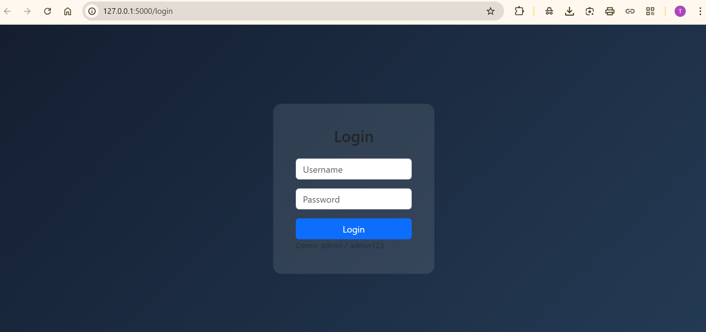
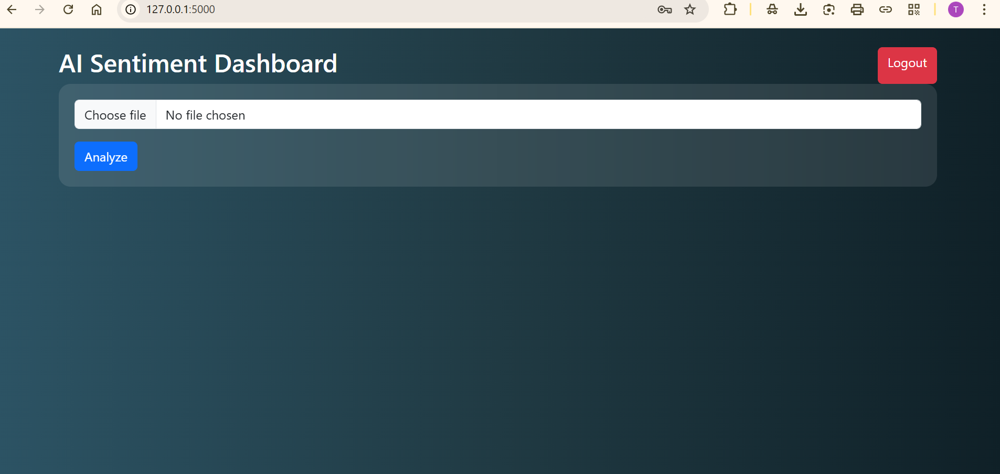
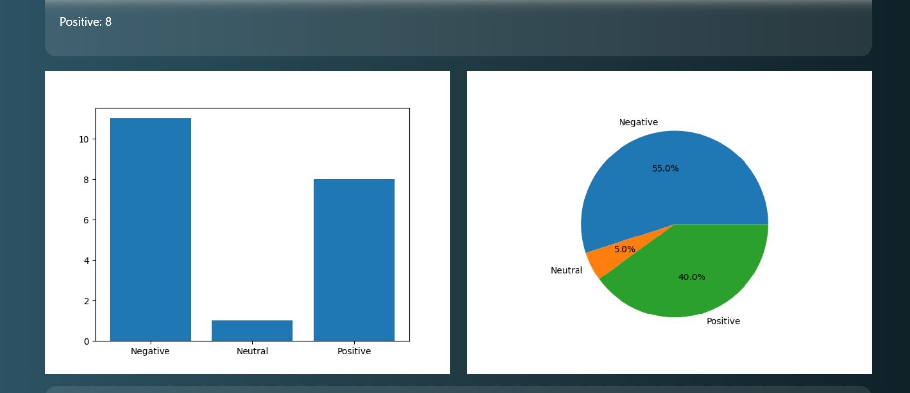
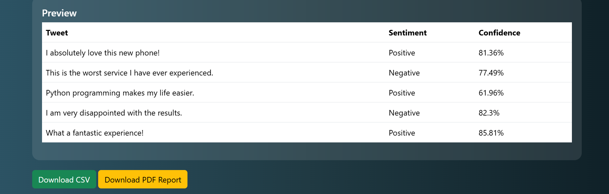

# 🚀 X-Sentiment-Analyzer

> AI-Powered Sentiment Analysis Dashboard built with Flask, Scikit-learn & NLP

---

## 📌 Overview

**X-Sentiment-Analyzer** is a full-stack Machine Learning web application that performs sentiment analysis on tweets using Natural Language Processing and Logistic Regression.

The application allows users to upload CSV files containing tweets, analyze sentiments in bulk, visualize results, and export detailed reports.

---

## 🧠 Machine Learning Details

### 📊 Dataset
- Sentiment140 Dataset
- Balanced sampling (20,000 Positive / 20,000 Negative)

### 🔀 Train/Test Split
- 70/30 Split (Stratified)

### 🎯 Model
- TF-IDF Vectorizer (`max_features=5000`)
- Logistic Regression
- Average Accuracy: **~75%**

### 📈 Confidence Score Calculation

Confidence score is calculated using:

```
confidence = max(prediction_probability) × 100
```

Neutral sentiment is assigned when:

```
abs(positive_prob - negative_prob) < 0.15
```

---

## ✨ Features

### 🔐 Authentication System
- Login page
- Session-based authentication
- Protected dashboard access

### 📂 CSV Upload
- Upload CSV file containing a `tweet` column
- Bulk sentiment analysis

### 📊 Analytics Dashboard
- Bar Chart Visualization
- Pie Chart Distribution
- Animated Counters
- Live Preview Table (Top 5 Results)

### 📥 Export Options
- Download analyzed CSV
- Generate and download PDF report

---

## 📁 Project Structure

```
X-Sentiment-Analysis/
│
├── app.py
├── data/
│   └── sentiment140.csv
├── templates/
│   ├── login.html
│   └── index.html
├── static/
│   ├── charts/
│   ├── results/
│   ├── reports/
│   └── assets/
│
└── README.md
```

---

# 📸 Project Screenshots

## 🔐 Login Page


---

## 📊 Dashboard


---

## 📈 Charts Visualization


---

## 📄 PDF Report


---

# ⚙️ Installation Guide

```bash
# Clone repository
git clone https://github.com/your-username/X-Sentiment-Analysis.git

# Navigate to folder
cd X-Sentiment-Analysis

# Create virtual environment
python -m venv sentiment_env

# Activate environment (Windows)
sentiment_env\Scripts\activate

# Install dependencies
pip install -r requirements.txt

# Run application
python app.py
```

Then open in browser:

```
http://127.0.0.1:5000
```

---

# 🛠️ Tech Stack

- Python
- Flask
- Scikit-learn
- NLTK
- Pandas
- Matplotlib
- FPDF
- Bootstrap 5
- HTML/CSS

---

# 🚀 Future Improvements

- Deep Learning Integration (LSTM / BERT)
- Real-time Twitter API Integration
- Database-backed Authentication
- Cloud Deployment
- Model Optimization

---

# 👨‍💻 Author

**Tanish**

If you like this project, ⭐ Star this repository!
